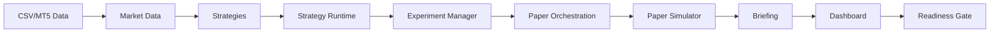

# Architecture

> **PAPER-ONLY / DATA-ONLY.** No live trading. No order submission. Not financial advice.

## System Overview

Quant_Agent is a modular Python system for quantitative research. It processes CSV market data, generates strategy signals, runs experiments, simulates paper portfolios, and presents results through a local dashboard.

## Modules

```
strategies/          — Strategy library and signal definitions
strategy_lab/        — Strategy development and validation tools
market_data/         — Market data ingestion and CSV handling
strategy_runtime/    — Strategy execution engine
experiment_manager/  — Parameter sweep and experiment tracking
dashboard/           — Local web dashboard (read-only)
paper_orchestration/ — Paper trading workflow manager
data_manager/        — Dataset import and versioning
research_analytics/ — Performance attribution and analytics
paper_simulator/     — Portfolio simulation engine
briefing/            — Daily report generation
local_app/           — Local application launcher and config
readiness_gate/      — Safety audit and readiness scoring
tools/               — CLI workflow tools
tests/               — pytest test suite
examples/            — Example configuration files
docs/                — Documentation
```

## Data Flow

```
CSV/MT5 Data
    |
    v
market_data (import + validate)
    |
    v
strategies (signal generation)
    |
    v
strategy_runtime (backtest / paper run)
    |
    v
experiment_manager (parameter sweep)
    |
    v
paper_orchestration (decision engine)
    |
    v
paper_simulator (portfolio simulation)
    |
    v
briefing (daily report)
    |
    v
dashboard (local visualization)
    |
    v
readiness_gate (safety audit)
```

## Key Design Principles

1. **Paper-only by default** — All trading logic is simulation-only.
2. **CSV-first** — Market data comes from CSV files, not live APIs.
3. **Local-only** — Dashboard runs on 127.0.0.1 by default.
4. **No credentials in repo** — All configs are examples; real credentials stay local.
5. **Safety-first** — Readiness gate audits every release.

## Mermaid Diagram



## Safety Boundaries

- `paper_simulator/` never submits orders.
- `readiness_gate/` explicitly does not approve live trading.
- `tools/` CLI scripts print commands but do not install cron automatically.
- `dashboard/` is read-only and hosted on localhost.

## Phase 30A Correctness Boundaries

The quantitative core now treats accounting correctness as a release boundary:

- **Causal execution:** historical `next_close` fills require a decision timestamp and the first valid later bar; no latest-price fallback is allowed.
- **Single-source accounting:** transaction costs are recorded once, while realized and unrealized PnL remain gross price PnL; equity reconciles from those components.
- **Position lifecycle:** repeated fills aggregate consistently and closed positions cannot continue contributing unrealized PnL or margin.
- **Exposure invariant:** FX contract size is applied exactly once when converting lot quantity and price to notional exposure.
- **Fail-closed safety:** invalid risk inputs, missing paper-safety flags, unknown broker modes, and non-practice OANDA hosts are rejected.
- **Audit continuity:** JSONL audit chains continue their sequence/hash linkage across process restarts.

These boundaries must remain covered by regression tests before new execution capabilities are added.
